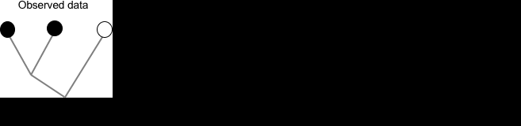

<!-- From https://stackoverflow.com/a/37839683/1297830 -->
<link rel="stylesheet" type="text/css" href="include/hideOutput.css">
<script src="include/hideOutput.js"></script>

By Michael C. Grundler


```{r echo=FALSE}
# Options for building this document
knitr::opts_chunk$set(
  fig.height=4,
  fig.width=6,
  fig.align='center',
  message=FALSE,
  warning=FALSE
)

fn = local({
  i = 0
  function(x) {
    i <<- i + 1
    if (missing(x) || is.null(x) || x == "")
        sprintf('Figure %s', i)
    else
        sprintf('Figure %s: %s', i, x)
  }
})
```

Continuous-time Markov chain (CTMC) models have been around for a long time but
they didn't become mainstream in the phylogenetics field until [Felsenstein (1981)](https://doi.org/10.1007/BF01734359)
published an efficient algorithm for computing the likelihood of a phylogeny from
a DNA sequence using a CTMC as a probabilistic model for base substitutions.
This algorithm, dubbed the "pruning" algorithm, also forms the basis for
likelihood calculations of continuous characters as well.

A decade later, [Jansen (1992)](https://doi.org/10.2307/2409810) pointed out that
Markov models can be used to test hypotheses about non-molecular characters and used
seed dispersal syndromes as an example. He also anticipated the
need for state-dependent speciation-extinction models in the same paper. A few
years later, [Pagel (1994)](https://doi.org/10.1098/rspb.1994.0006) introduced
a CTMC method for detecting correlated evolution among different characters.

Since then the use of CTMC's as probabilistic models for the evolutionary
process has risen in popularity, and they have largely replaced parsimony in
the literature on macroevolution.

In this module, we'll take a brief look at some of the theory of CTMC's and
then apply these methods to a comparative analysis of _Anolis_ ecomorphs.

# CTMC models in theory

A CTMC is a probabilistic model of evolution that describes a
stochastic process for transitioning between different character states along
a phylogenetic lineage. At any point in time the lineage is in a single state but
at random times the lineage can switch to a different state and will
remain in that state until the next evolutionary event of character change. For
example, one history might look something like,

```{r echo=FALSE}
ecomorphs = c("Grass-bush (GB)", "Trunk-ground (TG)", "Trunk (T)", "Trunk-crown (TC)",
  "Crown-giant (CG)", "Twig (TW)")

colv = c(
"#f6e8c3",
"#d8b365",
"#8c510a",
"#5ab4ac",
"#01665e",
"#c7eae5")

```


```{r echo=FALSE, fig.cap=fn()}
plot.new()
plot.window(xlim=c(0, 1), ylim=c(0, 5))
segments(0, 3, 0.2, 3, lwd=3, col=colv[3])
points(0, 3, pch=21, bg=colv[3], cex=3)
text(0, 3, expression(X(t[1])), pos=1, offset=1)
segments(0.2, 3, 0.2, 4, lwd=1, lty=2)
segments(0.2, 4, 0.6, 4, lwd=3, col=colv[4])
points(0.2, 4, pch=21, bg=colv[4], cex=3)
text(0.2, 4, expression(X(t[2])), pos=3, offset=1)
segments(0.6, 4, 0.6, 1, lty=2)
segments(0.6, 1, 0.8, 1, lwd=3, col=colv[1])
points(0.6, 1, pch=21, bg=colv[1], cex=3)
text(0.6, 1, expression(X(t[3])), pos=1, offset=1)
segments(0.8, 1, 0.8, 2, lty=2)
segments(0.8, 2, 1, 2, lwd=3, col=colv[2])
points(0.8, 2, pch=21, bg=colv[2], cex=3)
text(0.8, 2, expression(X(t[4])), pos=3, offset=1)


arrows(0, 0, 1, 0, length=0.1, lwd=3)
mtext("Time", 1, 2)
```

Time is measured on the horizontal axis and the state of the lineage is recorded
on the vertical axis. At any point in time the lineage is in a single state but
at times $t_2, t_3$ and $t_4$ the lineage switches to a different state and
remains in that state until the next evolutionary event of character change. The
notation $X(t)$ is used for the state of the lineage to denote that it is a function
of time.

From the model's perspective, evolving from one state to another is like flipping
a (possibly many-sided) coin. Each coin flip is one event of character change.
There are three things to keep in mind.

1. The coin may not be a fair coin.
It might be easier for evolution to shape a trunk ecomorph into a trunk-crown
ecomorph than into a twig ecomorph, for example.

1. The coin may be different depending on the state of the lineage. For example,
we might flip one coin if the lineage is in the trunk state but another coin if
it is in the twig state.

1. The time we wait before flipping the coin might also differ depending on
the state of the lineage.

To formally describe the behavior of a CTMC we use something called a rate matrix,
commonly denoted with the boldface letter **Q**. As the name implies, entries in
**Q** are rates that describe the behavior of the CTMC on a single lineage. For
example, a CTMC with 3 states may have a rate matrix that looks like,

```{r echo=FALSE}
Q = matrix(0.5, 3, 3)
diag(Q) = -1
Q
```

Each row and column of **Q** denotes a character state. The value `Q[i, j]` is
the rate of leaving state $i$ for state $j$. The value `Q[i, i]` is the rate
of leaving state $i$ for any other state and hence is denoted by a negative
number. To relate the entries in **Q** to the three points mentioned above consider
that,

1. If a lineage is currently in state $i$, the probability that the next event
of character change will be to state $j$ is `-Q[i, j] / Q[i, i]`. Thus, if the
off-diagonal entries of row $i$ are not equal to one another evolution will
proceed in some directions preferentially to others.

1. If `-Q[i, k] / Q[i, i] != -Q[j, k] / Q[j, j]` then the direction evolution is likely to take will
differ depending on whether the lineage begins in state $i$ or state $j$.

1. If `-Q[i, i] > -Q[j, j]` then a lineage in state $i$ will, on average, change to
a different state sooner than a lineage in state $j$. (The actual time a lineage
remains in a state is a random variable that has an exponential distribution with
a mean equal to `-1 / Q[i, i]`)


In case it is not evident already, `Q[i, i]` equals the sum of all off-diagonal
entries in row $i$ multiplied by minus one.

The rate matrix has a fundamental role in determining the probability that a lineage
initially in state $i$ will be in state $j$ at some later time in the future. These
probabilities are called **_transition probabilities_** and are often written as
$p_{ij}(t)$: the probability that a lineage in state $i$ at time 0 is in state $j$
at time $t$.

Transition probabilities can be organized into a matrix **P** that has the same
number of rows and columns as there are character states. We won't go into the
details but it can be shown that the transition probabilities are equal to,

$\mathbf{P} = e^{\mathbf{Q}t}$

Where $e^{\mathbf{Q}t}$ is known as the matrix exponential. The element `P[i, j]`
is the probability of transitioning from state $i$ to state $j$ in the given
amount of time $t$. We will see in subsequent sections the critical role transition
probabilities play in fitting CTMC models to data.

The `Matrix` package has capability to compute the matrix exponential. For example,
using the `Q` matrix from above we can see that over a short amount amount
of time it is highly unlikely that a lineage will be in any other state but the
starting state:

```{r}
P = Matrix::expm(Q * 0.01)
P
```

Notice how all the diagonal elements are almost 1. However, as time goes by these
probabilities decay and the odds of the lineage being in a derived state increase:

```{r}
Matrix::expm(Q * .2)
```

## Exercises

1. Using the same `Q` matrix, continue the exercise started above. Keep lengthing
the amount of time over which evolution has to occur. What happens to the resulting
**P** matrix?

1. Repeat the first exercise but alter the `Q` matrix so that it remains symmetric
but not all off-diagonals are equal.

1. Repeat the first exercise but alter the `Q` matrix so that it is no longer
symmetric.

Try these exercises on your own. If you need a hint, here is a solution:

<div class='fold s'>

```{r, fig.show='hide', fig.keep='none'}
# show how the transition probability from i to j behaves
# as a function of Q and time
pij = function(
Q,              # rate matrix
i,              # starting state
j,              # ending state
vmax,           # maximum time for evolution
add=FALSE,      # add to existing plot?
...) {          # plotting options from ?par

    if (!all(diag(Q) < 0))
        stop("Diagonals must be negative.")

    if (!all(Q[upper.tri(Q)] >= 0) && !all(Q[lower.tri(Q)] >= 0))
        stop("Off-diagonals must be non-negative.")

    if (!all.equal(sum(Q), 0))
        stop("Off-diagonals don't sum to diagonals.")

    if (!add) {
        plot.new()
        plot.window(xlim=c(0, vmax), ylim=c(0, 1))
        axis(1)
        axis(2, las=1)
        box(bty='l')
        mtext("Time", 1, 2)
        mtext("Transition probability", 2, 2.5)
    }

    v = seq(0, vmax, length.out=10)
    pij = sapply(v, function(z) Matrix::expm(Q*z)[i, j])

    points(v, pij, ...)
}

pij(Q, 1, 1, 5, type='l', col=2)
pij(Q, 1, 3, 5, type='l', lty=2, col=2, add=TRUE)

```

</div>

## Take-aways

1. The **Q** matrix expresses tempo (speed of evolutionary change) and mode
(pattern of evolutionary change)

1. The diagonal entries of a **Q** matrix are rates of leaving one state for
another (tempo).

1. An off-diagonal entry _(i, j)_ divided by the corresponding diagonal entry is the
probability observing a transition from _i_ to _j_ whenever an event of character state
change occurs (mode).

1. Transition probabilities are functions of tempo and mode. They
determine the probability that a lineage initially in state $i$ is in state $j$
at some later point in the future.


# CTMC models in practice


In practice we are not working with a single lineage but with a phylogeny, and
we are not given a rate matrix but have to estimate it. How do we do this?

Consider that we have the following two things:

1. _Data_: Our observed data consist of a set of character states coded for
terminal taxa in a phylogeny.

1. _Model_: Our model of evolution is the CTMC embodied by a particular **Q**
matrix specification. Technically, the phylogeny and branch lengths relating the
species in our study are part of the model. But these are usually estimated
independently with molecular data and are treated as fixed for most comparative
analyses. So, the only parameters in the model that need to be estimated are the
transition rates of the **Q** matrix.

To estimate the parameters of the model we use likelihood. Likelihood is just a
probability: it is the probability of generating the observed data given a
particular set of model parameters. The goal of any likelihood analysis is to
find the values of the model parameters that maximize the probability of the
data.

Computing the likelihood is really just an elaborate summation. To compute the
sum, we pretend that we are able to observe the character states of the ancestors
of the living species in our dataset: we do this by assigning a character state to each
ancestor. There are typically many possible ways we could assign character states
to these ancestors. To compute the likelihood we have to sum over each of these
possible assignments. So, the contribution of each assignment to the total sum
is weighted by the likelihood the assignment has of explaining the observed
data. The actual likelihood computation uses the transition probabilities you
learned about in the last section: we visit each branch and compute the probability
of going from the ancestral state to the descendant state in the given amount of
time with the given **Q** matrix. The likelihood is just the product of all these
transition probabilities. This whole process is illustrated in the animation below,
where likelihood is denoted by the letter L and the P(i->j) notation means the
transition probability of going from the state at node i to the state at node j.





Fortunately, we don't have to do these sums and products ourselves because they
are implemented more cleverly in a variety of R packages. Let's see how to use those.

First, let's create the dataset in the animation
```{r}
library(ape)

newick = "((t1:1,t2:1):1,t3:2):0;"
phy = ape::read.tree(text=newick)

tip.states = structure(c(1L,1L,0L), names=phy$tip.label)

```

Now we can use the package `diversitree` to create a function which computes the
likelihood of the data.

```{r}
library(diversitree)

lik = diversitree::make.mk2(phy, tip.states)
lik = diversitree::constrain(lik, q01~q, q10~q, extra="q")
lik
```

To break this down a little: `make.mk2` will create a function to perform the
likelihood computation shown in the animation. By default, it needs to accept
2 parameters (corresponding to the 2 transition rates in a rate matrix with only
2 states). The `constrain` function allows us to implement constraints on these
parameters. Here, we are constraining both transition rates to equal each other
and we are calling that single rate "q".

With a likelihood function in hand, we can go ahead and try out different values
for the parameters. For example, a rate of 0.1 gives a log likelihood of

```{r}
lik(0.1)
```

## Exercises

1. Continue the exercise you started above and find the value of the rate that
maximizes the likelihood of the data.

1. Perform the same exercise but this time assuming that both rate parameters
are free to vary.

Try these exercises on your own. For both exercises, be sure to make a plot of
the likelihood surface. If you need a hint, here is a solution:
<div class='fold s'>
```{r, fig.show='hold', fig.keep='none'}

# Exercise 1.

rateval = seq(0.1, 1, by=0.1)
loglk = sapply(rateval, lik)

# To find the precise value that maximizes the likelihood, we can use another
# diversitree function - find.mle - which performs the same exercise that you just
# did but using a more sophisticated approach to find the optimum. It takes a
# likelihood function and an initial starting parameter(s):

mle = diversitree::find.mle(lik, x.init=0.3)

plot(rateval, loglk, las=1, type='b')
points(mle$par, mle$lnLik, pch="+", col=2)


# Exercise 2.

# remake the likelihood function so that it is no longer constrained
lik = diversitree::make.mk2(phy, tip.states)

# initialize both parameters at the maximum likelihood value for the
# constrained model
mle = diversitree::find.mle(lik, x.init=c(0.3, 0.3))

# Let's also visualize the likelihood surface on a grid

q01 = q10 = seq(0.01, 1, 0.01)
z = matrix(0, 100, 100)
for (i in 1:100) {
    for (j in 1:100)
        z[i, j] = lik(c(q01[i], q10[j]))
}

contour(q01, q10, z, nlevels=20)
mtext("q01", 1, 2)
mtext("q10", 2, 2.5)

points(0.3, 0.3, pch="+", cex=2)
text(0.3, 0.3, "Initial value", pos=1)
points(mle$par[1], mle$par[2], pch="+", cex=2)
text(mle$par[1], mle$par[2], "Final value", pos=1)

# What do you notice? The maximum likelihood value returned by find.mle is not
# actually the maximum likelihood value! This may not be surprising because we
# started the search on a broad plateau where all parameter combinations yield
# essentially the same likelihood. In fact, the maximum likelihood value
# occurs in a tiny corner of the parameter space: where q10 is near 0.3 (
# the MLE when both rates are constrained equal) and q01 is essentially 0.
# This suggests that even though the likelihood is greater when we fit a model
# where both parameters vary, one of those parameters is not distinguishable
# from 0 and is poorly estimated. We probably are not justified in our choice of
# a 2 parameter model despite what the raw likelihood value tells us.

# Suppose we start in a position where the algorithm can find the MLE
fit = optim(log(c(.1, .3)), function(z) -lik(exp(z)), hessian=TRUE)

# Compute the confidence intervals. (We won't go into the theory behind how to
# do this, so don't dwell on it.)
bb = qnorm(1-0.05/2, sd=sqrt(diag(solve(fit$hessian))))

# Take a look at how poorly characterized these estimates are:
invisible(structure(rbind(exp(fit$par - bb), exp(fit$par + bb)),
    dimnames=list(c("lower", "upper"), c("q01", "q10"))))

# Compare this to when we only estimated a single rate
lik = diversitree::make.mk2(phy, tip.states)
lik = diversitree::constrain(lik, q01~q, q10~q, extra="q")
fit = optim(log(0.3), function(z) -lik(exp(z)), hessian=TRUE, lower=-10, upper=0, method="Brent")

bb = qnorm(1-0.05/2, sd=sqrt(1/fit$hessian[1]))
invisible(structure(rbind(exp(fit$par - bb), exp(fit$par + bb)),
    dimnames=list(c("lower", "upper"), "q")))

```

</div>

## Take-aways

1. Likelihood is just the probability of generating the data given a set of
model parameters.

1. Computation of the overall (marginal) likelihood involves summing up the
likelihoods of all possible assignments of character states to ancestral species.

1. The maximum likelihood estimate of transition rate parameters may be a local
maximum rather than a global maximum.

1. The model with the highest likelihood may not always be the best choice.


# Fitting CTMC models to data

Now that we've seen the major pieces of CTMC models and how we can use them with
a phylogeny and character data let's look at a real-world dataset.

We'll be working with a subset of the data published by [Mahler et al. (2013)](https://doi.org/10.1126/science.1232392)
in their study on anole ecomorph evolution in the Greater Antilles.

Load the data into R. Perhaps take this opportunity to clean your workspace, too.

```{r}
anoles = ape::read.tree("anoles.tre")
ecomorphs = read.csv("ecomorphs.csv", stringsAsFactors=FALSE)
```

Take a moment to familiarize yourself with the dataset. How many species are there,
how many ecomorphs, what is their phylogenetic distribution?


```{r echo=FALSE, fig.cap=fn("Anole ecomorph dataset")}

colv = structure(c(
"#f6e8c3",
"#d8b365",
"#8c510a",
"#5ab4ac",
"#01665e",
"#c7eae5"), names=c("T","TG","TW","TC","CG","GB"))

ord = match(anoles$tip.label, ecomorphs[, 1])

par(mar=c(0,0,0,0), bg="light grey")
plot(anoles, tip.color=colv[ecomorphs[ord, 2]], edge.color=1, x.lim=c(0, 100))
legend("topright", bty="n", legend=c(
"Trunk", "Trunk-Ground", "Twig", "Trunk-Crown", "Crown-Giant",
"Grass-Bush"), text.col=colv)
```

## Reconstructing ancestors: state estimation at internal nodes

A good starting point for exploring a comparative dataset is to try and get a
sense of patterns in the data. Ancestral state reconstructions are a good place to
start because they allow us to visualize possible histories of change and to
count different types of character state transitions. These patterns may be interesting
in their own right and might also suggest hypotheses to test.

The simplest evolutionary model is one in which there is a single rate of change
and all character transitions are equiprobable. This is analagous to the Jukes-Cantor
model from phylogenetics and is commonly called the "equal rates" model in
macroevolution. It also has a number of interesting connections to the method
of maximum parsimony ([Tuffley & Steel 1997](https://doi.org/10.1007/BF02459467)).
I recommend always keeping the starting analysis simple and then building in
complexity if warranted.

Remember that from the last section we computed the likelihood of the data by
summing over all possible ancestral character state reconstructions. The parameter
values of transition rates estimated using this approach are therefore not
conditioned on any single history of character evolution. Nonetheless, we can
still use these parameter estimates to say something about the likely state of
an ancestor.

Consider a single ancestral node, say node $i$. The basic approach for computing
the likely ancestral state of node $i$ is to hold the  state of node $i$ fixed,
and then compute the likelihood of the data by summing over all possible
configurations of ancestral node states where node $i$ is in the fixed state. By repeating
this process for all states we can compute a probability that node $i$ is in each
state as the relative contribution each likelihood has to the sum of all likelihoods.
This is known as the marginal ancestral state reconstruction
for node $i$. By repeating this process for all ancestral nodes we can get a
complete set of ancestral state estimates.

More concretely, looking at the animation from above: the marginal ancestral state
probability that node 4 is in the black state is equal to $\frac{L_2+L_3}{L_1+L_2+L_3+L_4}$
and the probability that it is in the white state is equal to $\frac{L_1+L_4}{L_1+L_2+L_3+L_4}$.

Again, we can take advantage of existing functionality in the `diversitree`
package to avoid computing these by hand.

Using the diversitree functions `make.mkn`, `constrain`, `find.mle`, and `asr.marginal`,
try recreating the plot shown below.

If you get stuck you can use the solution below. For this exercise be sure
to constrain all transition rates to the same value and perform the marginal
ancestral state reconstructions using the MLE for the rate.

<div class='fold s'>
```{r fig.cap=fn("Ancestral state reconstructions")}

# colors for ecomorph states
colv = structure(c(
"#f6e8c3",
"#d8b365",
"#8c510a",
"#5ab4ac",
"#01665e",
"#c7eae5"), names=c("T","TG","TW","TC","CG","GB"))

state.space = structure(1L:6L, names=c("CG", "GB", "T", "TC", "TG", "TW"))

tip.states = structure(match(ecomorphs[, 2], names(state.space)),
    names=ecomorphs[, 1])

# create the likelihood function
lik = diversitree::make.mkn(anoles, tip.states, 6)

# constrain the likelihood function such that all rates
# are identical
formulae = list()
for (i in 1:6) {
  for (j in 1:6) {
    if (i != j)
      formulae = c(formulae, sprintf("q%s%s ~ q", i, j))
  }
}
lik.er = diversitree::constrain(lik, formulae=formulae, extra="q")

# find the maximum likelihood estimate for the rate
fit = diversitree::find.mle(lik.er, 0.1)

# Compute marginal ancestral state probabilities using the MLE for the rate.
# Columns in the returned matrix correspond to internal nodes and rows correspond
# to states. The node index of the j-th column is j + Ntip(anoles).
asr = diversitree::asr.marginal(lik.er, fit$par)
rownames(asr) = names(state.space)

# for plotting, ensure ordering of data aligns between tree and data matrix
ord = match(anoles$tip.label, ecomorphs[, 1])

par(mar=c(0,0,0,0), bg="light grey")
plot(anoles, tip.color=colv[as.character(ecomorphs[ord, 2])], edge.color=1, x.lim=c(0, 100))
legend("topright", bty="n", legend=c(
"Trunk", "Trunk-Ground", "Twig", "Trunk-Crown", "Crown-Giant",
"Grass-Bush"), text.col=colv)
ape::nodelabels(pie=t(asr), piecol=colv[rownames(asr)], cex=0.5)
```
</div>

### Exercises
1. What happens to the marginal ancestral state probabilities when the rate of
evolution is high? Explain this behavior in terms of transition probabilities.


## Counting evolutionary changes: stochastic character mapping

Studying the marginal ancestral state estimates suggests that nearly all events
of character state change have occurred from an ancestral Trunk-Ground form. In fact,
if we imagine assigning one state to each internal node it looks as though 6
of 8 events of character state change have occurred from a Trunk-Ground ancestor.

To make this estimate more precise we have to simulate histories of character
evolution. This is known as stochastic character mapping and is described in
detail by [Nielsen (2002)](https://doi.org/10.1080/10635150290102393). We omit
the details here other than to say that it is nothing more than the process
depicted in Figure 1 applied to each branch of the tree (with some modifications
to ensure that the simulated history is consistent with the data).

`diversitree` has two functions to perform stochastic mapping. `asr.stoch` and
`make.asr.stoch`. The former requires a likelihood function and a set of transition
rate parameters and will perform one simulation. The latter takes a likelihood
function and returns a function to perform stochastic mapping; the returned
function only requires transition rate parameter(s) as its argument. For example,

```{r}
asr = diversitree::make.asr.stoch(lik.er)
history = asr(fit$par)
```

Will perform one stochastic map using the likelihood function `lik.er` and the
MLE value for the rate stored in `fit$par`. Using this as background, attempt to
reproduce the figure below, which plots the average number of transitions between
each pair of character states from 1,000 stochastic character maps.

If you need a hint, here is a solution.
<div class='fold s'>
```{r}
asr = diversitree::make.asr.stoch(lik.er)
history = replicate(1000, asr(fit$par)$history)

# a matrix to hold the average number of transitions from one state to another
counts = matrix(0L, 6, 6, dimnames=list(names(state.space), names(state.space)))

invisible(apply(history, 2, function(h) {

  for (b in 1:nrow(history)) {
    node = b

    # root node is not included in history so if the index is greater
    # than the number of terminal nodes we need to increment it by 1 to refer
    # to the correct node
    if (b > Ntip(anoles))
      node = b + 1

    if (nrow(h[[b]]) > 1) {

      # this branch has at least 1 event of change

      for (i in 2:nrow(h[[b]])) {
        anc.state = h[[b]][i-1, 2]
        deriv.state = h[[b]][i, 2]
        counts[anc.state, deriv.state] <<- counts[anc.state, deriv.state] + 1 / 1000
      }

    }

  }

}))

par(bg='light grey')
plot.new()
plot.window(xlim=c(0, 6), ylim=c(0, 6))
for (i in 2:6) {
  for (j in 1:(i-1)) {
    points(i, j, cex=counts[i, j])
    points(j, i, cex=counts[j, i])
  }
}
text(1:6, rep(0, 6), names(state.space), col=colv[names(state.space)], cex=1)
text(rep(0, 6), 1:6, names(state.space), col=colv[names(state.space)], cex=1)
mtext("Ancestral state", 1, 2)
mtext("Derived state", 2, 2.5)
box(bty='l')
text(5, 2, sprintf("%.2f", counts[5, 2]), pos=4, offset=1, cex=0.6)
text(2, 5, sprintf("%.2f", counts[2, 5]), pos=4, offset=0.5, cex=0.6)
title("Circle size is equal to average count")
```
</div>

### Exercises

1. What happens to the stochastic character maps as the rate of evolution is increased?
**Warning:** do not increase the rate of character evolution too much, otherwise your
simulations may not finish for a long time. Keep the max below 0.1. Explain this
behavior in terms of transition probabilities.


## Hypothesis testing

Suppose we divide the anole environment into three vertical strata corresponding
to ground, trunk, and crown layers like so,

```{r, echo=FALSE, fig.width=4.88, fig.height=6.04, fig.cap=fn("Modified from Losos (2009)")}
obj = png::readPNG("./include/ecomorphs.png")
par(mar=c(0,0,0,0), oma=c(1,1,0,1))
plot.new()
plot.window(xlim=c(0, 1), ylim=c(0, 1))

# cribbed from https://stackoverflow.com/questions/27800307/adding-a-picture-to-plot-in-r
addImg = function(obj, x, y, height) {
    USR <- par("usr")
    PIN <- par("pin")
    DIM <- dim(obj)
    ARp <- DIM[2]/DIM[1] # pixel aspect ratio (x/y)
    HEIi <- height/(USR[4]-USR[3])*PIN[2] # convert height units to inches
    WIDi <- HEIi * ARp # height in inches
    WIDu <- WIDi/PIN[1]*(USR[2]-USR[1]) # width in units
    rasterImage(image = obj, ybottom = y-(height/2), ytop = y+(height/2),
        xleft = x-(WIDu/2), xright = x+(WIDu/2))
}

addImg(obj, 0.2, 0.5, 1)
abline(h=0.05, lty=2)
abline(h=0.3, lty=2)
abline(h=0.5, lty=2)
abline(h=0.9, lty=2)

text(0.8, 0.15, "Ground stratum")
text(0.8, 0.4, "Trunk stratum")
text(0.8, 0.65, "Crown stratum")
```

It is evident from the ancestor reconstructions and stochastic character maps
that most evolution seems to have occurred in a vertical fashion, from the
"ground up" so to speak. Suppose we are interested in investigating this pattern
further with the aim of testing whether evolution proceeds in the sequence
suggested by the ancestor reconstructions, specifically,

```{r echo=FALSE, fig.cap=fn()}

plot.new()
plot.window(xlim=c(1, 4), ylim=c(0, 1))
text(1, 1, "TG")
text(2, 1, "T")
text(3, 1, "TC")
text(4, 1, "CG")
text(1, 0, "GB")
text(3, 0, "TW")
arrows(1.1, 1, 1.9, 1, length=0.1, code=3)
arrows(2.1, 1, 2.9, 1, length=0.1, code=3)
arrows(3.1, 1, 3.9, 1, length=0.1, code=3)
arrows(1.1, 1, 1.9, 1, length=0.1, code=3)
arrows(1, 0.1, 1, 0.9, length=0.1, code=3)
arrows(3, 0.1, 3, 0.9, length=0.1, code=3)
```

We can contrast this hypothesis with a null hypothesis that each ecomorph state
is equally likely to evolve from one ecomporph as any other ecomorph (which is
the model we used to perform the ancestor reconstructions and stochastic maps).

Use the `diversitree` functions `make.mkn` and `find.mle` to test these two
hypotheses and compare their likelihoods.

If you need a hint, here is a solution:

<div class='fold s'>
```{r}
# CG: 1
# GB: 2
# T:  3
# TC: 4
# TG: 5
# TW: 6

# Permissible sequences given hypothesis:
#
# CG <-> TC: 1, 4
# TW <-> TC: 6, 4
# T  <-> TC:  3, 4
# TG <-> GB: 5, 2
# TG <-> T:  5, 3

# Set all permissible moves to 1
Q = matrix(0, 6, 6)
Q[1, 4] = Q[4, 1] = 1
Q[6, 4] = Q[4, 6] = 1
Q[3, 4] = Q[4, 3] = 1
Q[5, 2] = Q[2, 5] = 1
Q[5, 3] = Q[3, 5] = 1

formulae = list()
for (i in 1:6) {
  for (j in 1:6) {
    if (i != j) {
      if (Q[i, j])
        formulae = c(formulae, sprintf("q%s%s ~ q", i, j))
      else
        formulae = c(formulae, sprintf("q%s%s ~ 0", i, j))
    }
  }
}
lik.h1 = diversitree::constrain(lik, formulae=formulae, extra="q")

formulae = list()
for (i in 1:6) {
  for (j in 1:6) {
    if (i != j)
      formulae = c(formulae, sprintf("q%s%s ~ q", i, j))
  }
}
lik.h0 = diversitree::constrain(lik, formulae=formulae, extra="q")

fit.h1 = diversitree::find.mle(lik.h1, .1)
fit.h0 = diversitree::find.mle(lik.h0, .1)

# Try several other random starting values
for (start in runif(5, 0, 0.1)) {
  fit.h1.tmp = find.mle(lik.h1, start)
  fit.h0.tmp = find.mle(lik.h0, start)

  if (fit.h0.tmp$lnLik > fit.h0$lnLik)
    fit.h0 = fit.h0.tmp

  if (fit.h1.tmp$lnLik > fit.h1$lnLik)
    fit.h1 = fit.h1.tmp
}
rm(fit.h0.tmp, fit.h1.tmp, start)
```
</div>

### Exercises
1. Remake Figure 3, which visualizes marginal ancestral state probabilities. How
have the root state probabilities changed? How have the probabilities for the
ancestor of _A. valencienni_ changed?

1. Contrast the hypothesis in Figure 5 with the equal rates model but this time
allow a separate transition rate for each pair of transitions. After fitting the
model, repeat exercise 1.

1. Repeat exercise 2 but allow for asymmetric rates between each pair of permissible
transitions. After fitting the model, repeat exercise 1.

1. What does the fitted model from exercise 3 imply about the long-term state
frequency distribution? Repeat exercise 3 but constrain the long-term state
frequency distribution to match the state frequency distribution observed
among the terminal taxa. After fitting the model, repeat exercise 1.

Solution for Exercise 2:
<div class='fold s'>

```{r}
# Set all permissible moves to 1
Q = matrix(0, 6, 6)
Q[1, 4] = Q[4, 1] = 1
Q[6, 4] = Q[4, 6] = 1
Q[3, 4] = Q[4, 3] = 1
Q[5, 2] = Q[2, 5] = 1
Q[5, 3] = Q[3, 5] = 1

formulae = list()
k = 1
for (i in 2:6) {
  for (j in 1:(i-1)) {
      if (Q[i, j] > 0) {
        formulae = c(formulae, sprintf("q%s%s ~ q%s", i, j, k))
        formulae = c(formulae, sprintf("q%s%s ~ q%s", j, i, k))
        k = k + 1
      } else {
        formulae = c(formulae, sprintf("q%s%s ~ 0", i, j))
        formulae = c(formulae, sprintf("q%s%s ~ 0", j, i))
      }
  }
}

lik.h2 = diversitree::constrain(lik, formulae=formulae, extra=c("q1", "q2", "q3", "q4", "q5"))
fit.h2 = diversitree::find.mle(lik.h2, runif(5, 0, .05))
```
</div>

Solution for Exercise 3:
<div class = 'fold s'>

```{r}
# Set all permissible moves to 1
Q = matrix(0, 6, 6)
Q[1, 4] = Q[4, 1] = 1
Q[6, 4] = Q[4, 6] = 1
Q[3, 4] = Q[4, 3] = 1
Q[5, 2] = Q[2, 5] = 1
Q[5, 3] = Q[3, 5] = 1

formulae = list()
for (i in 2:6) {
    for (j in 1:(i-1)) {
        if (Q[i, j] < 1) {
            formulae = c(formulae, sprintf("q%s%s ~ 0", i, j))
            formulae = c(formulae, sprintf("q%s%s ~ 0", j, i))
        }
    }
}

lik.h3 = diversitree::constrain(lik, formulae=formulae)
fit.h3 = diversitree::find.mle(lik.h3, runif(10, 0, .05))
```
</div>

Solution for Exercise 4:
<div class = 'fold s'>

```{r}

make.Q = function(fit, nstate=6L)
{
    # Make a Q matrix from fitted parameters

    Q = matrix(0, nstate, nstate)
    for (i in 1L:nstate) {
        for (j in 1L:nstate) {
            if (i != j)
                Q[i, j] = fit$par.full
        }
    }
    diag(Q) = -rowSums(Q)
    return (Q)
}

# Long-term state frequency implied by model:
#     The "twig" ecomorph is essentially fixed
# Matrix::expm(make.Q(fit.h3) * 1e9)[1L, ]

# Maybe you find this strange considering there is only a single "twig" species
# in the dataset. So let's fit an asymmetric model but this time constrain
# the equilibrium distribution to equal state frequency distribution observed
# among the terminal taxa.

eq = tabulate(tip.states) / Ntip(anoles)

Q = matrix(0, 6, 6)
Q[1, 4] = Q[4, 1] = 1
Q[6, 4] = Q[4, 6] = 1
Q[3, 4] = Q[4, 3] = 1
Q[5, 2] = Q[2, 5] = 1
Q[5, 3] = Q[3, 5] = 1

# We do this by building the equilibrium frequencies into the transition rates
# just like the GTR models used in phylogeny inference. So each term in the
# rate matrix will look like:
#   qij = a * eq[j]
#   qji = a * eq[i] = qij * eq[i]/eq[j]
#
# where `a` is a relative rate that is unique to each (i, j) pair. In other
# words, the rate of transition from i to j is equal to the long-term frequency
# of state j multiplied by a scalar constant.

formulae = list()
for (i in 2:6) {
    for (j in 1:(i-1)) {
        if (Q[i, j] < 1) {
            formulae = c(formulae, sprintf("q%s%s ~ 0", i, j))
            formulae = c(formulae, sprintf("q%s%s ~ 0", j, i))
        } else {
            formulae = c(formulae, sprintf("q%s%s ~ q%s%s * %s", j, i, i, j, eq[i]/eq[j]))
        }
    }
}

lik.h4 = diversitree::constrain(lik, formulae=formulae)

fit.h4 = diversitree::find.mle(lik.h4, runif(5, 0, .05))

# confirm that equilibrium distribution matches constraint

# all.equal(Matrix::expm(make.Q(fit.h4) * 1e9)[1, ], eq)

```
</div>

## Model selection

Model selection is a way to choose the best model (by some criterion) among multiple competing
alternatives. At first glance it might appear that the best model is simply the
model with the highest likelihood. The problem with this approach is that the
best model under this criterion will often be the most parameter rich. As we add
more parameters to the model, its ability to explain the data increases. But that
increased explanatory power may be spurious: the additional parameters may simply
be capturing noise in the system.

The Akaike information criterion (AIC) is a way of comparing model fits that
incorporates a penalty term related to the number of parameters ([Akaike 1974](https://doi.org/10.1109/TAC.1974.1100705)).
Specifically, it is equal to $-2L + 2k$, where $L$ is the log likelihood of the
fitted model and $k$ is the number of parameters in the model.

The best model under this framework is the one that minimizes AIC. Minimizes because
we've taken the negative of $L$ (recall that good model fits have large $L$ and
therefore small -$L$) and added a positive penalty.

AIC scores are frequently expressed relative to the best model. Thus, for model
$i$ we might express its score as $\Delta{AIC_i} = AIC_i - AIC_{min}$. These
$\Delta{AIC}$ scores can be converted to measures of relative likelihood termed
Akaike weights. Thus, the weight of model $i$ would equal

$$\frac{\exp(-0.5 * \Delta{AIC_i})}{\sum_j{\exp(-0.5 * \Delta{AIC_j})}}$$

These weights are often interpreted as the probability that a particular model is
the "true" model.

### Exercises

1. Use AIC to select the "best" model from among the 5 model fits constructed in
the previous exercises.

Solution:
<div class = 'fold s'>

```{r}
aic = numeric(5)
for (k in 0L:4L) {
    fit = get(sprintf("fit.h%s", k))

    npar = length(fit$par)
    lnLik = fit$lnLik

    aic[k+1] = -2*lnLik + 2*npar
}

aic.weight = exp(-0.5*(aic-min(aic))) / sum(exp(-0.5*(aic-min(aic))))

# plot(aic.weight, type="h", ylim=c(0, 1), las=1L, ylab="AIC weight")
```
</div>

## Take-aways

1. Different rate matrices express different hypotheses about tempo and mode of
character evolution.

1. Ancestral state reconstructions depend strongly on the hypothesized model of
character evolution.

1. Asymmetric rate matrices may imply long-term state frequency distributions that are
very different from the observed state frequency distribution.

1. We can constrain the long-term state frequency distribution implied by an
asymmetric rate matrix to match the observed state frequency distribution by using
the GTR model from phylogenetics.

1. Using AIC for model selection attempts to balance the risks of underfitting (too
few parameters leading to poor model fit) and overfitting (too many parameters
leading to perfect model fit).

# Assessing adequacy of model fit

Model selection relies on comparisons of _relative_ fit. E.g., select the model
with the highest likelihood or the lowest AIC. Often we are more interested in
knowing whether or not the model provides a good description of properties of
the observed data. In other words, does the model _adequately_ describe
the data. If it doesn't, that tells us that our model is mis-specified in some way
and that we should search for alternatives. It is not guaranteed that the
best fitting model is adequate. The issue of model adequacy in macroevolution is
important but understudied. Good references are [Pennell et al. (2015)](https://doi.org/10.1086/682022),
[Rabosky and Goldberg (2015)](https://doi.org/10.1093/sysbio/syu131), and
[Beaulieu and O'Meara (2016)](https://doi.org/10.1093/sysbio/syw022).

Probably the first step toward assessing model adequacy is to compare the results
and implications of the fitted model to biological expectations. If they conflict, it is wise to be
suspicious. After all, our macroevolutionary models are simple, phenomenological,
and informed by limited data.

A more quantitative approach for assessing model adequacy is to compute a set of summary
statistics from the observed data, generate simulated datasets from a fitted
model, recompute the same set of summary statistics on each simulated dataset,
and compare the statistics from the observed data to those from the simulated
data.

If the model is a good statistical description of the data the observed statistics
are expected to look like the statistics computed from the simulated data. Note,
however, that a model can simultaneously be adequate in one respect but inadequate
in another.

The choice of summary statistics is not always clear and to some extent must be
guided by researcher intuition about important features of the data that the
model should capture. For continuous characters, [Pennell et al. (2015)](https://doi.org/10.1086/682022)
provide a set of recommendations, but no comparable studies and recommendations
are available for discrete characters. Here, we suggest the following
test statistics.

Test statistic |                          Description
-------------- | --------------------------------------------------------------
F              | The minimum number of character state changes necessary to \
                 explain the distribution of states among the terminal taxa. \
                 Determined by the Fitch maximum parsimony algorithm.
f              | Coefficient of variation when F is computed for each internal \
                 node rather than just the root node.
D              | The probability that two terminal taxa chosen at random have the \
                 same character state. Measures the dominance of character states \
                 among the terminal taxa. Large values indicate that the majority \
                 of taxa are in a single state.
d              | Coefficient of variation when D is computed for each internal \
                 node rather than just the root node.
S              | Variance of branch lengths among states divided by variance of \
                 branch lengths within states. Branch lengths are assigned to states \
                 using the Fitch maximum parsimony algorithm. This is simply the \
                 F statistic from an ANOVA. Designed to test for systematic differences \
                 in branch lengths among states such as would be expected if rates of \
                 speciation and extinction depended on the state of a lineage.

Below are functions to compute each of these summary stats.

<div class='fold s'>
```{r}

fitch.down = function(phy, x) {
    stopifnot(attr(phy, "order") == "cladewise")

    preorder = c(ape::Ntip(phy)+1L, phy$edge[, 2L])
    postorder = rev(preorder)
    postorder = postorder[postorder > ape::Ntip(phy)]

    nnode = phy$Nnode + ape::Ntip(phy)

    if (!is.null(names(x)))
        x = x[phy$tip.label]

    downpass = vector("list", ape::Nnode(phy))

    for (i in 1L:ape::Ntip(phy))
        downpass[[i]] = x[i]

    children = function(d) {
        phy$edge[which(phy$edge[, 1L] == d), 2L]
    }

    pscore = integer(ape::Ntip(phy)+ape::Nnode(phy))

    for (nd in postorder) {
        d = children(nd)

        pscore[nd] = pscore[d[1L]] + pscore[d[2L]]

        downpass[[nd]] = intersect(downpass[[d[1]]], downpass[[d[2]]])

        if (length(downpass[[nd]]) == 0) {
            downpass[[nd]] = union(downpass[[d[1]]], downpass[[d[2]]])
            pscore[nd] = pscore[nd] + 1L
        }

    }

    return (list(downpass=downpass, count=pscore))
}

fitch.up = function(phy, downpass) {
    stopifnot(attr(phy, "order") == "cladewise")

    preorder = phy$edge[, 2L]
    preorder = preorder[preorder > ape::Ntip(phy)]

    uppass = downpass

    parent = function(d) {
        phy$edge[match(d, phy$edge[, 2L]), 1L]
    }

    children = function(d) {
        phy$edge[which(phy$edge[, 1L] == d), 2L]
    }

    for (n in preorder) {

        d = children(n)
        p = parent(n)

        if (identical(intersect(uppass[[p]], downpass[[n]]), uppass[[p]]))
            uppass[[n]] = uppass[[p]]
        else if (length(intersect(downpass[[d[1L]]], downpass[[d[2L]]])) == 0L)
            uppass[[n]] = union(uppass[[p]], downpass[[n]])
        else
            uppass[[n]] = union(downpass[[n]], intersect(uppass[[p]], union(downpass[[d[1L]]], downpass[[d[2L]]])))
    }

    return (uppass)
}

big.f = function(phy, x) {
    # x is our vector of tip states

    fitch.down(phy, x)[[2]][ape::Ntip(phy)+1L]
}

little.f = function(phy, x) {
    # x is our vector of tip states

    pscore = fitch.down(phy, x)[[2]]
    return (sd(pscore) / mean(pscore))
}

big.d = function(phy, x, k) {
    # x is our vector of tip states
    # k is the number of states

    n = tabulate(x, k)
    N = sum(n)
    return (sum((n * (n-1)) / (N * (N-1))))
}

cache.descendants = function(phy)
{
    ntip = ape::Ntip(phy)
    d = vector("list", ape::Nnode(phy))

    for (n in 1L:ape::Nnode(phy)) {
        tips = ape::extract.clade(phy, n+ntip)$tip.label
        tips = match(tips, phy$tip.label)
        d[[n]] = tips
    }

    attr(phy, "descendants") = d

    return (phy)
}

little.d = function(phy, x, k) {
    stopifnot(!is.null(attr(phy, "descendants")))
    stopifnot(!is.null(names(x)))

    desc = attr(phy, "descendants")

    x = x[phy$tip.label]

    d = numeric(ape::Nnode(phy))

    for (n in 1L:ape::Nnode(phy))
        d[n] = big.d(phy, x[desc[[n]]], k)

    return (sd(d) / mean(d))
}

big.s = function(phy, x, k) {
    stopifnot(attr(phy, "order") == "cladewise")

    mpr = fitch.up(phy, fitch.down(phy, x)[[1]])

    y = c()
    g = c()

    nnode = ape::Ntip(phy) + ape::Nnode(phy)

    brlen = numeric(nnode)
    brlen[phy$edge[, 2L]] = phy$edge.length

    for (n in phy$edge[, 2L]) {
        s = mpr[[n]]
        y = c(y, rep(brlen[n], length(s)))
        g = c(g, s)
    }

    anova(lm(y~g))[1, 4]
}

```
</div>

## Exercises

1. Use these summary statistics to assess the adequacy of the two best models
as determined using AIC in the previous exercises.

Solution to exercise 1 for the S statistic:
<div class='fold s'>
```{r}
Q = matrix(0, 6, 6)
Q[1, 4] = Q[4, 1] = 1
Q[6, 4] = Q[4, 6] = 1
Q[3, 4] = Q[4, 3] = 1
Q[5, 2] = Q[2, 5] = 1
Q[5, 3] = Q[3, 5] = 1

for (i in 2:6) {
    for (j in 1:(i-1)) {
        if (Q[i, j] > 0) {
            Q[i, j] = fit.h1$par
            Q[j, i] = fit.h1$par
        }
    }
}

diag(Q) = 0
diag(Q) = -rowSums(Q)

char = diversitree::make.sim.character(anoles, Q, model="mkn")

root.p = diversitree::asr.marginal(lik.h1, fit.h1$par)[, 1L]

r = numeric(1000L)
for (i in 1L:999L)
    r[i] = big.s(anoles, char(sample(1L:6L, 1L, prob=root.p)), 6L)
r[1000L] = big.s(anoles, tip.states, 6)

# sum(r >= r[1000L]) / 1000L

```
</div>

# Testing for an effect of a discrete character on a continuous character

In some cases our question may not be about putative ancestral states or modes
of evolution but about the effect of one character on another. In particular, we
may wish to know if a discrete character, like ecomorph type, has an effect on
the average value of a continuous character, like body size or limb length. One way to
address this type of question is through phylogenetic analysis of variance (
phylogenetic ANOVA). Phylogenetic ANOVA is just like ordinary ANOVA except that
we compare the computed F statistic to a simulated distribution that accouts for
phylogeny rather than to a F-distribution. Recall that the F statistic is simply
the variance among groups divided by the variance within groups.

More concretely, we can imagine we have a continuous variable $y$ and a grouping
factor $x$. Species might have similar $y$-values because they share the same
grouping factor $x$ or because they share evolutionary
history and inherit similar values of $y$ from common ancestors.

To test for an effect of $x$ on $y$ we simulate the evolution of $y$ on our phylogeny
assuming that $x$ has no effect on $y$. From these simulated
datasets we can construct a distribution F statistics that we expect to observe in
the absence of any effect of $x$ on $y$. This procedure was first described by
[Garland et al. (1993)](https://doi.org/10.1093/sysbio/42.3.265)
and later elaborated by [Adams and Collyer (2018)](https://doi.org/10.1111/evo.13492).

## Exercises

1. Use phylogenetic ANOVA to evaluate the hypothesis that ecomorph class has no
effect on anole body size.

1. Do the same for relative hindlimb length.

Solution for exercise 1:
<div class='fold s'>
```{r}

bm.rate = function(phy, x)
{
    # Compute the maximum likelihood estimate of the rate of Brownian motion.
    # This is just variance of standardized phylogenetic independent contrasts

    stopifnot(inherits(phy, "phylo"))
    stopifnot(!is.null(names(x)))

    rate = var(ape::pic(x, phy))

    return (rate)
}

F.stat = function(x, g)
{
    # Compute the F statistic
    # x is our continuous variable
    # g is our grouping factor

    anova(lm(x~g))[1, 4]
}

t.stat = function(x, g)
{
    # Modified from pairwise.t.test

    # x is our continuous variable
    # g is our grouping factor

    g = as.factor(g)
    levs = levels(g)
    m = length(levs)

    xbar = tapply(x, g, mean, na.rm = TRUE)
    s = tapply(x, g, sd, na.rm = TRUE)
    s[is.na(s)] = 0
    n = tapply(!is.na(x), g, sum)
    degf = n - 1
    total.degf = sum(degf)
    pooled.sd = sqrt(sum(s^2 * degf)/total.degf)

    compare.levels = function(i, j) {
        dif = xbar[i] - xbar[j]
        se.dif = pooled.sd * sqrt(1/n[i] + 1/n[j])
        t.val = dif/se.dif
        return (t.val)
    }

    r = matrix(0, m, m, dimnames=list(levs, levs))

    for (i in 1:m) for (j in 1:m) r[i, j] = compare.levels(i, j)

    return (r)
}

svl = structure(ecomorphs[, 3L], names=ecomorphs[, 1L])

rate = bm.rate(anoles, svl)

# Maximum likelihood estimate the ancestral body size at the root of the phylogeny
mu = ape::ace(svl, anoles, method="pic")$ace[1]

# Observed ratio of between ecomorph variance to within ecomorph variance (of log
# body size)
f.obs = F.stat(svl, ecomorphs[, 2L])

# Observed pairwise t-statistics
t.obs = t.stat(svl, ecomorphs[, 2L])

# Simulate log-transformed body sizes under Brownian motion assuming no effect of
# ecomorph class on body size evolution
svl.null = replicate(999L, diversitree::sim.character(anoles, rate, mu))
svl.null = cbind(svl.null, svl)

# Compute the ratio of between ecomorph variance to within ecomorph variance that
# we expect to observe under the hypothesis that ecomorph class has no effect on
# body size
f.null = apply(svl.null, 2L, function(z) F.stat(z, ecomorphs[, 2L]))

# Compute pairwise t-statistics
t.null = array(0, c(6L, 6L, 1000L))
t.null[,, 1000L] = t.obs
for (i in 1L:999L)
    t.null[,, i] = t.stat(svl.null[, i], ecomorphs[, 2L])

# Assess the likelihood that the observed statistic is from the null hypothesis
# sum(f.null >= f.obs) / 1000L

# hist(f.null, col=8)
# abline(v=f.obs, lty=2, lwd=2)

# Post-hoc assessment of pairwise differences in group means
pval = matrix(0, 6L, 6L, dimnames=list(levels(as.factor(ecomorphs[, 2])), levels(as.factor(ecomorphs[, 2]))))
for (i in 1L:6L) {
    for (j in 1L:6L) {
        pval[i, j] = sum(abs(t.null[i, j, ]) >= abs(t.obs[i, j])) / 1000L
    }
}

# Examining these P-values reveals that most of the strong differences are from
# contrasts between the Twig ecomorph and others and between the Crown-giant
# ecomorph and others. However, each of these ecomorphs has a single species in
# the current dataset. A strong claim for a general effect of ecomorph on body
# size should use a larger dataset with more independent origins of the different
# ecomorph classes.
# pval

# This is also evident from just plotting the data
# boxplot(ecomorphs[, 3L] ~ ecomorphs[, 2L], las=1, ylab="Log body size")
```
</div>


Solution for exercise 2:
<div class='fold s'>
```{r}

hl = structure(log(exp(ecomorphs[, 4]) + exp(ecomorphs[, 5])) - svl, names=ecomorphs[, 1L])

rate = bm.rate(anoles, hl)

mu = ape::ace(hl, anoles, method="pic")$ace[1]

f.obs = F.stat(hl, ecomorphs[, 2L])

t.obs = t.stat(hl, ecomorphs[, 2L])


hl.null = replicate(999L, diversitree::sim.character(anoles, rate, mu))
hl.null = cbind(hl.null, hl)

f.null = apply(hl.null, 2L, function(z) F.stat(z, ecomorphs[, 2L]))

t.null = array(0, c(6L, 6L, 1000L))
t.null[,, 1000L] = t.obs
for (i in 1L:999L)
    t.null[,, i] = t.stat(hl.null[, i], ecomorphs[, 2L])

# sum(f.null >= f.obs) / 1000L

# hist(f.null, col=8)
# abline(v=f.obs, lty=2, lwd=2)

pval = matrix(0, 6L, 6L, dimnames=list(levels(as.factor(ecomorphs[, 2])), levels(as.factor(ecomorphs[, 2]))))
for (i in 1L:6L) {
    for (j in 1L:6L) {
        pval[i, j] = sum(abs(t.null[i, j, ]) >= abs(t.obs[i, j])) / 1000L
    }
}

# Examining these P-values reveals that most of the strong differences are from
# contrasts between the Twig ecomorph and others. However, this ecomorphs has a
# single species in the current dataset. A strong claim for a general effect of
# ecomorph on relative hindlimb length should use a larger dataset with more
# independent origins of the different ecomorph classes.
# pval

# This is also evident from just plotting the data
# boxplot(hl ~ ecomorphs[, 2L], las=1, ylab="Relative hindlimb length")
```
</div>

